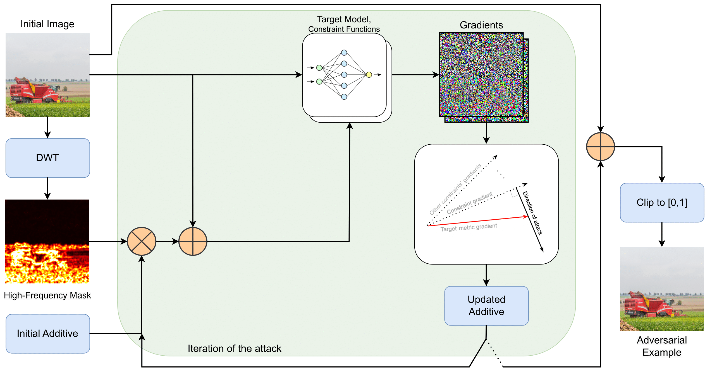

# FM-GOAT
Supplementary code for the paper "Evaluating Adversarial Robustness of No-Reference Image and Video Quality Assessment Models with Frequency-Masked Gradient Orthogonalization Adversarial Attack"

### Structure
* `fm_goat.py` - code for proposed FM-GOAT attack
* `other_attacks.py` - code for I-FGSM, Korhonen-et-al, Zhang-et-al attacks used in this work
* `other_attacks_unrestricted.py` - code for StAdv attack
* `example_use.ipynb` - Jupyter Notebook with example usage of the attack.
* `img/` - example images for the attack
