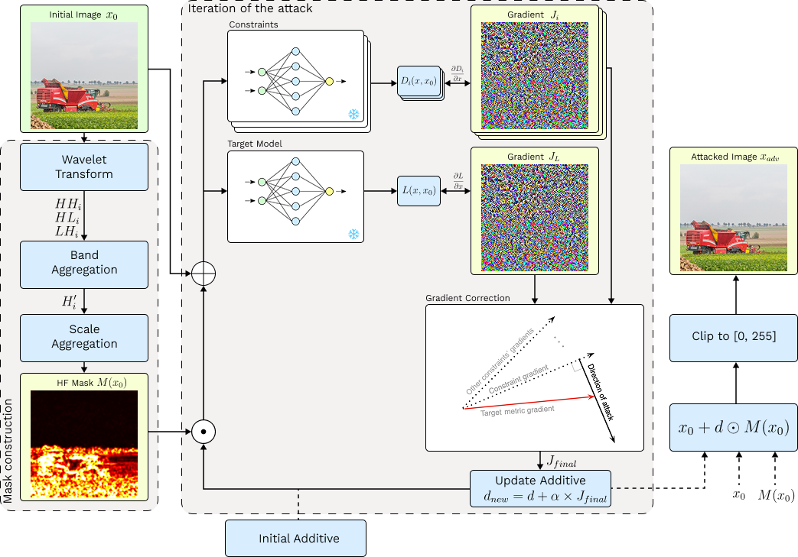

# FM-GOAT
Supplementary code for the paper "[Evaluating Adversarial Robustness of No-Reference Image and Video Quality Assessment Models with Frequency-Masked Gradient Orthogonalization Adversarial Attack](https://www.mdpi.com/2504-2289/9/7/166)"


## Structure
* `fm_goat.py` - code for proposed FM-GOAT attack
* `other_attacks.py` - code for I-FGSM, Korhonen-et-al, Zhang-et-al attacks used in this work
* `other_attacks_unrestricted.py` - code for StAdv attack
* `example_use.ipynb` - Jupyter Notebook with example usage of the attack.
* `img/` - example images for the attack


## Citation
If you find this work useful for your research, please cite us as follows:
```bibtex
@Article{bdcc9070166,
AUTHOR = {Abud, Khaled and Lavrushkin, Sergey and Vatolin, Dmitry},
TITLE = {Evaluating Adversarial Robustness of No-Reference Image and Video Quality Assessment Models with Frequency-Masked Gradient Orthogonalization Adversarial Attack},
JOURNAL = {Big Data and Cognitive Computing},
VOLUME = {9},
YEAR = {2025},
NUMBER = {7},
ARTICLE-NUMBER = {166},
URL = {https://www.mdpi.com/2504-2289/9/7/166},
ISSN = {2504-2289},
DOI = {10.3390/bdcc9070166}
}
```
